# BetSpecs: Real-Time Analytics Dashboard

> *Financial-terminal style interface for sports analytics.*

---

## The Problem

Sports data is fragmented across dozens of sources. Odds change by the second. AI tools hallucinate numbers. There is no single place to see the full picture with confidence.

## The Solution

BetSpecs aggregates live data, runs AI analysis, and verifies every output before displaying it.

It is a dashboard where I can see real-time odds, AI-driven insights, and my own performance tracking—all in one view. If the AI says something that does not match the source data, the output is rejected and regenerated.

---

## Core Capabilities

- **Real-Time Data Feed:** Aggregates odds and scores from multiple providers.
- **AI-Powered Insights:** Generates analysis with context from historical data.
- **Trust Layer:** Cross-checks AI outputs against verified sources. No hallucinations reach the UI.
- **Performance Tracking:** Logs decisions and tracks P&L over time.

---

## Architecture

```mermaid
flowchart LR
    classDef input fill:#1e293b,stroke:#3b82f6,stroke-width:1px,color:#93c5fd;
    classDef core fill:#1e293b,stroke:#a855f7,stroke-width:2px,color:#d8b4fe;
    classDef verify fill:#1e293b,stroke:#ef4444,stroke-width:2px,color:#fca5a5;
    classDef output fill:#064e3b,stroke:#10b981,stroke-width:2px,color:#6ee7b7;

    Sources["Data Sources"]:::input --> Ingest["Ingest"]:::core
    Ingest --> DB[(Verified Store)]:::input
    
    User["User Query"]:::input --> AI["AI Analysis"]:::core
    DB --> AI
    
    AI --> Trust{"Trust Layer"}:::verify
    DB --> Trust
    
    Trust -->|Pass| Display["✅ Display"]:::output
    Trust -->|Fail| Regenerate["🔄 Retry"]:::verify
```

---

> **[Back to Profile](https://github.com/shifujosh)**
