# BetSpecs: Real-Time Analytics That Never Hallucinates

> *A verification layer that catches AI mistakes before they reach users.*

---

## The Problem

AI is great at generating text, but it often invents numbers. Ask an LLM for sports stats, and it might confidently tell you a player scored 30 points when they actually scored 20. This is called "hallucination"—and it is unacceptable for real-time analytics.

## The Solution

BetSpecs cross-checks every AI output against verified data before displaying it.

If the AI says something that does not match the source data, the output is **rejected and regenerated**. This creates a "Trust Layer" that ensures users only see accurate information.

---

## How It Works

```mermaid
flowchart LR
    classDef stream fill:#1e293b,stroke:#3b82f6,stroke-width:1px,color:#93c5fd;
    classDef db fill:#1e293b,stroke:#0ea5e9,stroke-width:2px,color:#7dd3fc;
    classDef logic fill:#1e293b,stroke:#a855f7,stroke-width:2px,color:#d8b4fe;
    classDef error fill:#2a1a1a,stroke:#ef4444,stroke-width:2px,color:#fca5a5;
    classDef success fill:#1e293b,stroke:#10b981,stroke-width:2px,color:#6ee7b7;

    Data[Live Data]:::stream --> DB[(Verified Source)]:::db
    User[User Query]:::stream --> AI[AI Response]:::logic
    
    subgraph Trust ["🛡️ Trust Layer"]
        AI --> Check{"Does it match?"}:::logic
        DB --> Check
        Check -->|Yes| Display[✅ Show to User]:::success
        Check -->|No| Reject[❌ Regenerate]:::error
    end
```

**The key insight:** The verification step is *not* an AI. It is a deterministic logic engine that compares structured data. AI generates; logic verifies.

---

## Built With

- **TypeScript** — 100% type-safe across all I/O
- **Firebase** — Real-time data sync
- **Zod** — Runtime validation

---

> **[Back to Profile](https://github.com/shifujosh)**
